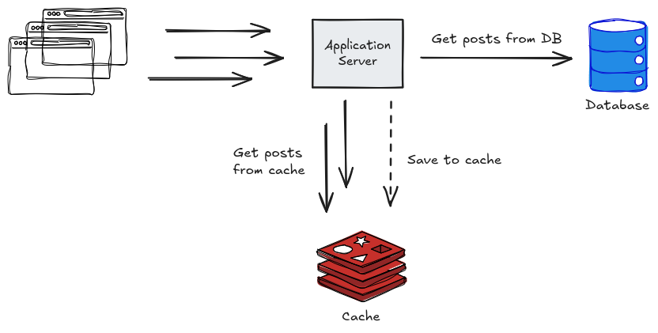

# Spring Redis Blueprint

A minimal Spring Boot microservice template with:

- REST API
- JWT authentication
- PostgreSQL persistence
- Redis caching
- Flyway migrations
- OpenAPI docs
- Unit and integration tests

## Getting Started

To run this project locally, you need:

- Java 25
- Docker + Docker Compose
- Gradle 9.2 (only if you do not use the bundled `./gradlew` wrapper)

## Architecture (Simplified)

This microservice template combines a relational database (PostgreSQL) for persistent data with an in-memory database (Redis) for caching.

## REST API

The service exposes REST endpoints for managing posts, categories, and tags. Read endpoints are public where applicable, while write operations are protected with JWT authentication. OpenAPI/Swagger documentation is available when the application is running.

## Databases and Data Usage

### PostgreSQL (Primary Database)

PostgreSQL is the **source of truth** for application data.

It stores relational entities such as:

- `users`
- `posts`
- `categories`
- `tags`

Usage:

- CRUD and filtered queries are handled through Spring Data JPA repositories.
- Schema changes are versioned and applied with Flyway.

### Redis (Cache Layer)

Redis is used as a **cache layer**, not as a primary datastore.

Usage:

- Post reads are cached (`POST_CACHE`) to reduce database access.
- Cached entries use TTL (10 minutes).
- Post updates/deletes evict cache entries to keep data consistent.

### Test Infrastructure

- **Unit tests** run without external infrastructure dependencies.
- **Integration tests** run with **Testcontainers**, provisioning required database resources in containers for test execution.

## Run Locally

1. Start infrastructure with Docker Compose:
   - `docker compose up -d`

2. Run the application:
   - `./gradlew bootRun`

## Run Tests

- `./gradlew test`

## API Docs

When the app is running, OpenAPI/Swagger UI is available through the springdoc endpoints.
